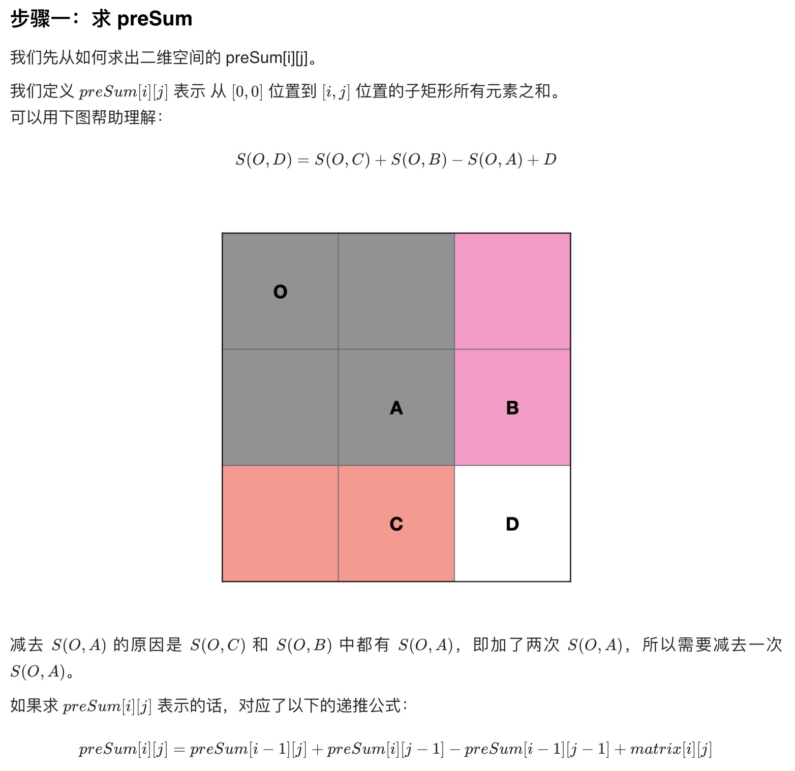
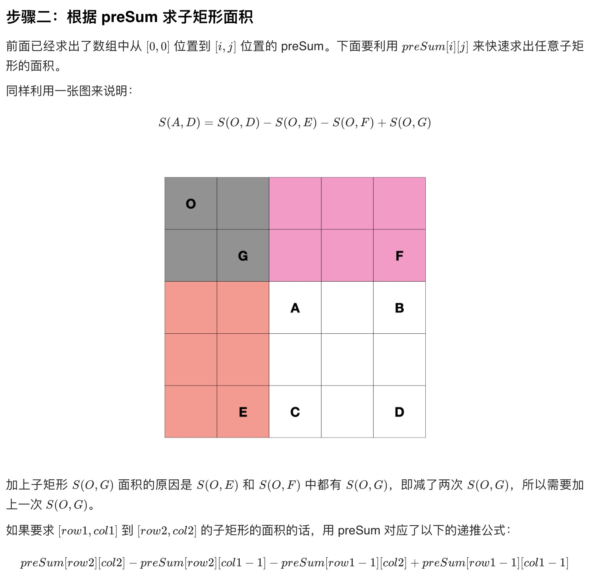

# Array

## 1d array

### 1. jump game 跳台阶

- [55. Jump Game](https://leetcode.com/problems/jump-game/)：判断能不能从 first index jump to last index  
  [java](/solution_java/0055_Jump_Game.java)
- [45. Jump Game II](https://leetcode.com/problems/jump-game-ii/): 判断 jump 到 last index 所需的最小 jump 次数是多少，greedy algorithm  
  [java](/solution_java/0045_Jump_Game_II.java)

### 2. hash table (hashmap + hashset)

- [1. Two Sum](https://leetcode.com/problems/two-sum/):
  [java](/solution_java/001_Two_Sum.java)
- [15. 3Sum](https://leetcode.com/problems/3sum/):
  [java](/solution_java/0015_3Sum.java)
- [128. Longest Consecutive Sequence](https://leetcode.com/problems/longest-consecutive-sequence/):
  [java](/solution_java/0128_Longest_Consecutive_Sequence.java)
- [217. Contains Duplicate](https://leetcode.com/problems/contains-duplicate/):
  [java](/solution_java/0217_Contains_Duplicate.java)
- [219. Contains Duplicate II](https://leetcode.com/problems/contains-duplicate-ii/):
  [java](/solution_java/0219_Contains_Duplicate_II.java)
- [扑克牌顺子](https://www.nowcoder.com/practice/762836f4d43d43ca9deb273b3de8e1f4?tpId=13&&tqId=11198&rp=1&ru=/ta/coding-interviews&qru=/ta/coding-interviews/question-ranking):
  [java](/牛客网/JZ45_扑克牌顺子.java)
- [957. Prison Cells After N Days](https://leetcode.com/problems/prison-cells-after-n-days/):
  [java](/solution_java/0957_Prison_Cells_After_N_Days.java)

### 2.1 将数组视为哈希表，原地哈希（哈希函数为：f(nums[i]) = nums[i] - 1）

- [41. First Missing Positive](https://leetcode.com/problems/first-missing-positive/):
  [java](/solution_java/0041_First_Missing_Positive.java)
- [442. Find All Duplicates in an Array](https://leetcode.com/problems/find-all-duplicates-in-an-array/):
  [java](/solution_java/0442_Find_All_Duplicates_in_an_Array.java)
- [448. Find All Numbers Disappeared in an Array](https://leetcode.com/problems/find-all-numbers-disappeared-in-an-array/):
  [java](/solution_java/0448_Find_All_Numbers_Disappeared_in_an_Array.java)

### 3. two pointer

- [905. Sort Array By Parity](https://leetcode.com/problems/sort-array-by-parity/):
  [java](/solution_java/0905_Sort_Array_By_Parity.java)  
  **如果要维持顺序的话就直接创建一个新的 array 判断奇偶再放入数组**  
  [调整数组顺序使奇数位于偶数前面](https://www.nowcoder.com/practice/ef1f53ef31ca408cada5093c8780f44b?tpId=13&&tqId=11166&rp=1&ru=/ta/coding-interviews&qru=/ta/coding-interviews/question-ranking):
  [java](/牛客网/JZ13_调整数组顺序使奇数位于偶数前面.java)
- [31. Next Permutation](https://leetcode.com/problems/next-permutation/):
  [java](/solution_java/0031_Next_Permutation.java)
- [75. Sort Colors](https://leetcode.com/problems/sort-colors/):
  [java](/solution_java/0075_Sort_Colors.java)
- [283. Move Zeroes](https://leetcode.com/problems/move-zeroes/):  
  [java](/solution_java/0283_Move_Zeroes.java)

### 4. math

- [Product of Array Except Self](https://leetcode.com/problems/product-of-array-except-self/):
  [java](/solution_java/0238_Product_of_Array_Except_Self.java)
- [348. Design Tic-Tac-Toe](https://leetcode.com/problems/design-tic-tac-toe/):
  [java](/solution_java/0348_Design_Tic-Tac-Toe.java)

### 5. 折线图(贪心)

- [134. Gas Station](https://leetcode.com/problems/gas-station/):
  [java](/solution_java/0134_Gas_Station.java)

### 6. 合并数组

- [合并排序的数组](https://leetcode-cn.com/problems/sorted-merge-lcci/):
  [java](/力扣/面试题10.01_合并排序的数组.java)

### 7. 前缀和 prefix sum (using hashmap)

### 7.1 一维前缀和：

1. 前缀和：nums 的第 **0** 项到 **当前项** 的和。
   用数组 prefixSum 表示，prefixSum[x]：第 0 项到 第 x 项 的和。
   prefixSum[x] = nums[0] + nums[1] + ... + nums[x]

2. nums 的某项 = 两个相邻前缀和的差：
   nums[x] = prefixSum[x] - prefixSum[x-1]

3. nums 的 第 i 到 j 项 的和，有：  
   nums[i] +...+ nums[j] = prefixSum[j] − prefixSum[i−1]

4. 当 i 为 0，此时 i-1 为 -1，我们故意让 prefixSum[-1] 为 0，使得通式在 i=0 时也成立：
   nums[0] +...+ nums[j] = prefixSum[j]

- [560. Subarray Sum Equals K](https://leetcode.com/problems/subarray-sum-equals-k/):
  [java](/solution_java/0560_Subarray_Sum_Equals_K.java)
- [303. Range Sum Query - Immutable](https://leetcode.com/problems/range-sum-query-immutable/):
  [java](/solution_java/0303_Range_Sum_Query-Immutable.java)
- [370. Range Addition](https://leetcode.com/problems/range-addition/):
  [java](/solution_java/0370_Range_Addition.md)

### 7.2 二维 matrix 前缀和

- [304. Range Sum Query 2D - Immutable](https://leetcode.com/problems/range-sum-query-2d-immutable/):
  [java](/solution_java/0304_Range_Sum_Query_2D-Immutable.java)

### 8. hashmap + array/sort

- [1481. Least Number of Unique Integers after K Removals](https://leetcode.com/problems/least-number-of-unique-integers-after-k-removals/):
  [java](/solution_java/1481_Least_Number_of_Unique_Integers_after_K_Removals.java)

### 9. sliding window + subarray

- [992. Subarrays with K Different Integers](https://leetcode.com/problems/subarrays-with-k-different-integers/):
  [java](/solution_java/0992_Subarrays_with_K_Different_Integers.md)

## 2d array -->> matrix

### 1. spiral matrix 螺旋矩阵

- [Spiral Matrix](https://leetcode.com/problems/spiral-matrix/):
  [java](/solution_java/0054_Spiral_Matrix.java)
- [59. Spiral Matrix II](https://leetcode.com/problems/spiral-matrix-ii/):
  [java](/solution_java/0059_Spiral_Matrix_II.java)
  **一样的题**  
  [顺时针打印矩阵](https://www.nowcoder.com/practice/9b4c81a02cd34f76be2659fa0d54342a?tpId=13&&tqId=11172&rp=1&ru=/ta/coding-interviews&qru=/ta/coding-interviews/question-ranking)

### 2. 旋转矩阵/翻转矩阵

- [48. Rotate Image](https://leetcode.com/problems/rotate-image/):
  [java](/solution_java/0048_Rotate_Image.java)

### 3. intervals 区间相关

- [56. Merge Intervals](https://leetcode.com/problems/merge-intervals/):
  [java](/solution_java/0056_Merge_Intervals.java)
- [57. Insert Interval](https://leetcode.com/problems/insert-interval/):
  [java](/solution_java/0057_Insert_Interval.java)
- [435. Non-overlapping Intervals](https://leetcode.com/problems/non-overlapping-intervals/):
  [java](/solution_java/0435_Non-overlapping_Intervals.java)

### 4. dfs

- [200. Number of Islands](https://leetcode.com/problems/number-of-islands/): [java](/solution_java/0200_Number_of_Islands.java)
