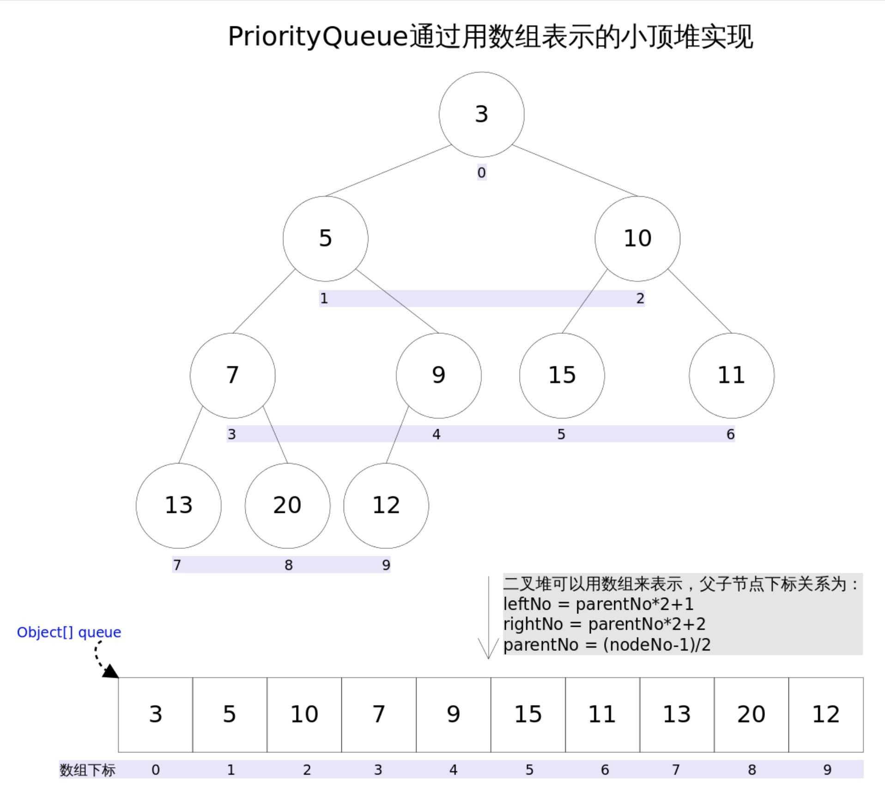

# 常用数据结构

## Scanner

```java
java.util.Scanner

Scanner sc = new Scanner(System.in);

int i = sc.nextInt(); //只读取数值，读取完后\n没有读取并且光标放在本行
sc.nextDouble()//的用法同理nextInt()，注意：nextInt无法读取小数，否则会报错。
//同理nextByte()nextFloat(),nextLong(),nextShot()，当某个方法读取的数字超过自身范围，则会报错。
sc.nextLine() //可以扫描到一行内容(当前行，光标所在行的内容，包括空格、回车)并作为一个字符串而被获取到。
sc.hasNextLine() //如果在此扫描器的输入中存在另一行，则返回 true。
sc.hasNext() //判断扫描器中当前扫描位置后是否还存在下一段
```

## String

```java
String s = "abc";
s.charAt(0);
s.length();
s.substring(0, 1);
s.substring(1);
s.equals("b");
s = s.trim();
s.indexOf("a");
s.indexOf("a", 1);
s.lastIndexOf("a");
s.indexOf("a", 1);
s.toCharArray();
Integer.valueOf(s); // returns an Integer object
Integer.parseInt(s); // returns an int primitive
String.valueOf(s); // integer to string
```

## StringBuilder

```java
StringBuilder sb = new StringBuilder();
sb.append("a");
sb.insert(0, "a");
sb.deleteCharAt(sb.length() ‐ 1);
sb.reverse();
sb.toString();
```

## Array

```java
int[] a = new int[10];
char[]b={'a','b'};
int[][] c = new int[10][10];
int m = a.length;
StringBuilder sb = new StringBuilder();
sb.append("a");
sb.insert(0, "a");
sb.deleteCharAt(sb.length() ‐ 1);
int n = c[0].length;
int max = Integer.MAX_VALUE;
int min = Integer.MIN_VALUE;
Arrays.sort(a);
for(inti=0;i<c.length;i++){
    System.out.println(c[i]);
}
```

## List

```java
List<Integer> list = new ArrayList<Integer>();
ArrayList<Integer> list1 = new ArrayList<Integer>();
List<List<Integer>> list2 = new ArrayList<List<Integer>>();

list.add(0);
list.add(0, 1);
list.get(0);
list.size();
list.remove(list.size() ‐ 1); //input is the position of the index to remove
Arrays.asList(1, 2, 3) // return [1, 2, 3]
Collections.sort(list);
Collections.sort(list, Collections.reverseOrder());
Collections.sort(list, new Comparator<Integer>() {
@Override
public int compare(Integer o1, Integer o2) {
    return o1 ‐ o2;// 0‐>1
    // return o2‐o1; 1‐>0
}
});
```

## Stack

```java
// Stack
Stack<Integer> stack = new Stack<Integer>();

stack.push(0);
stack.pop();
stack.peek();
stack.isEmpty();
stack.size();
```

## Queue 用 linkedlist 实现

```java
// Queue add ‐‐‐‐‐‐> remove, peek
Queue<Integer> q = new LinkedList<Integer>();

q.add(0);
q.remove();
q.peek();
q.isEmpty();
q.size();
```

`q.add()`现在用`q.offer()`来代替  
如果超出 queue 的 size `q.offer()`不会 return error 而是返回 false 是一个 boolean func
`q.remove()`现在用`q.poll()`代替

## Deque(Double-ended queue) 用 linkedlist 实现

```java
Deque<Interger> deque = new LinkedList<Interger>();

//向队头插入元素
deque.offerFirst()
deque.addFirst()

//向队尾插入元素
deque.offerLast()
deque.addLast()

//返回并移除队头元素
deque.pollFirst()
deque.removeFirst()

//返回并移除队尾元素
deque.pollLast()
deque.removeLast()

//获取队头元素但不移除
deque.peekFirst()
deque.getFirst()

//获取队尾元素但不移除
deque.peekLast()
deque.getLast()

//弹出栈中元素
deque.pop() //等价于 removeFirst()
//向栈中压入元素
deque.push() //等价于 addFirst()

//合并
deque.addAll() //input是list
```

## HashMap

```java
HashMap<Character, Integer> map = new HashMap<Character, Integer>();
map.put('c', 1);
map.get('c');
if (map.containsKey('c')) {
}
if (map.containsValue(1)) {
}
for (Character d : map.keySet()) {
 }
for (Integer i : map.values()) {
}
map.isEmpty();
map.size();

//遍历
//key
for(String key : map.keySet()){
    System.out.println(key);
}
//value
for(String value : map.values()){
    System.out.println(value);
}
```

## Hashset

```java
HashSet<Integer> set = new HashSet<Integer>();
set.add(0);
set.remove(0);
if (set.contains(0)) {
}
set.isEmpty();
set.size();
```

## PriorityQueue

```java
// min heap小顶堆
PriorityQueue<Integer> pq = new PriorityQueue<Integer>();
// max heap大顶堆
PriorityQueue<Integer> pq = new PriorityQueue<Integer>(Collections.reverseOrder());

pq.offer(0);
pq.poll();
pq.peek(); //返回第一个element
pq.isEmpty();
pq.size();
while (!pq.isEmpty()) {
}
```

Priority Queue 是通过完全二叉树（complete binary tree）实现的小顶堆（任意一个非叶子节点的权值，都不大于其左右子节点的权值，也可以通过数组来作为 PriorityQueue 的底层实现)，是自动排序的。

可以通过传入自定义的 Comparator 函数来实现大顶堆：

```java
private PriorityQueue<Integer> large = new PriorityQueue<>(new Comparator<Integer>() {
    @Override
    public int compare(Integer o1, Integer o2) {
        return o2.compareTo(o1);
    }
});
```



参考：https://www.cnblogs.com/Elliott-Su-Faith-change-our-life/p/7472265.html
