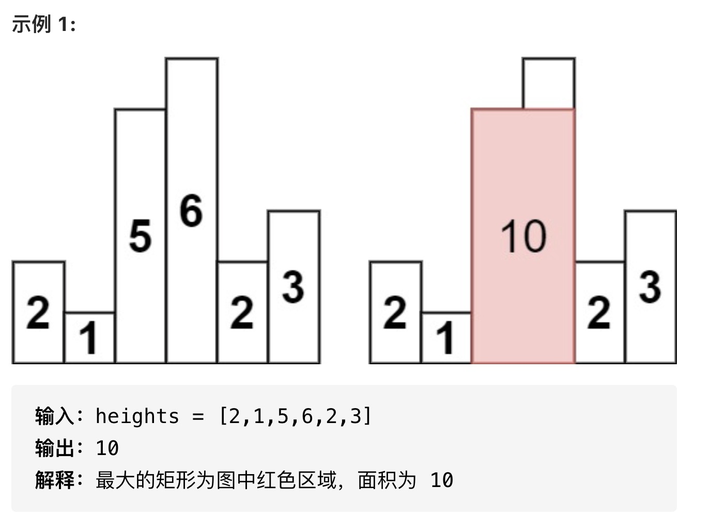

## 题目大意

给定 n 个非负整数，用来表示柱状图中各个柱子的高度。每个柱子彼此相邻，且宽度为 1 。
求在该柱状图中，能够勾勒出来的矩形的最大面积。


## 解题思路

用 stack 来记录当前最小高度
用 left[] 和 right[]来记录当前最小高度的左右位置
遍历一次，时间和空间复杂度都是 O(N)

```java
class Solution {
    public int largestRectangleArea(int[] heights) {
        int n = heights.length;
        int[] left = new int[n];
        int[] right = new int[n];
        Arrays.fill(right, n);

        Stack<Integer> stack = new Stack<Integer>();

        for(int i=0; i<heights.length; i++){
            while(!stack.isEmpty() && heights[i]<=heights[stack.peek()]){
                right[stack.peek()] = i;
                stack.pop();
            }
            left[i] = (stack.isEmpty() ? -1:stack.peek());
            stack.push(i);
        }

        int max = 0;
        for(int i=0; i<heights.length; i++){
            max = Math.max(max, (right[i]-left[i]-1) * heights[i]);
        }
        return max;
    }
}
```
