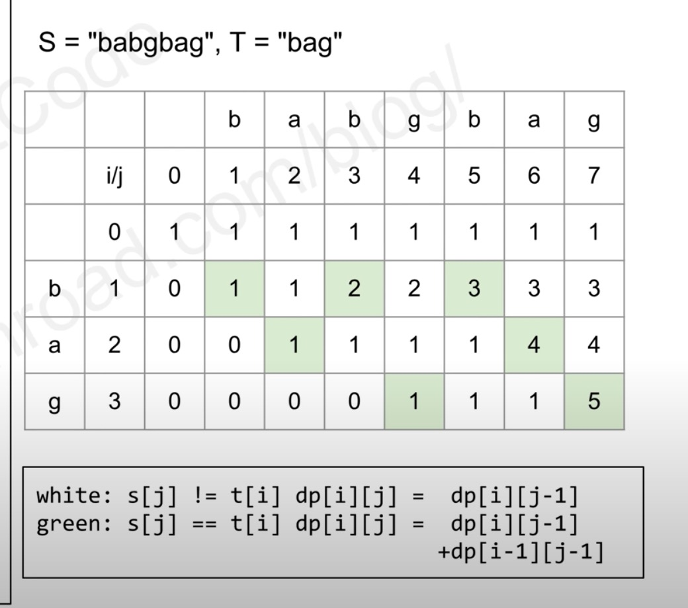

# 115. Distinct Subsequences

## problem

Given two strings s and t, return the number of distinct subsequences of s which equals t.

A string's subsequence is a new string formed from the original string by deleting some (can be none) of the characters without disturbing the remaining characters' relative positions. (i.e., "ACE" is a subsequence of "ABCDE" while "AEC" is not).

The test cases are generated so that the answer fits on a 32-bit signed integer.

Example 1:

Input: s = "rabbbit", t = "rabbit"
Output: 3
Explanation:

Example 2:

Input: s = "babgbag", t = "bag"
Output: 5

Constraints:

1 <= s.length, t.length <= 1000
s and t consist of English letters.

## solution

暴力解时间复杂度是 exponential，肯定超时
**这种两个 string 的 count 计数题问题都要想到 DP**



1. 子问题：s 的前 j 个字符包含多少个 t 的前 i 个字符：**dp[i][j] = s[1:j]包含 t[1:i]的个数**

2. init:
   dp[0][j] = 1, t 是空字符串的情况下

3. transition:

   ```java
       if  t[i] == s[j]
           dp[i][j] = dp[i][j-1]  //match s[j], t[i]
                   + dp[i-1][j-1]    //does not match s[j], t[i]

       else
           dp[i][j] = dp[i][j-1]    //skip s[j]
   ```

   比如 s=rabb t=rab 这个 b 可以与第一个 b 配对或者第二个 b 配对

4. time comlexity O(n^2), space complexity O(n)

## code

```java
//count计数题 & string subqeunce 通常都是使用dp来做
//两个string的用2d dp

class Solution {
    public int numDistinct(String s, String t) {
        int[][] dp = new int[t.length()+1][s.length()+1];

        //dp[i][j] = s[1:j] 中包含 t[1:i]的数量

        //init
        for(int j=0; j<=s.length(); j++)
            dp[0][j] = 1;

        //transition
        for(int i=1; i<=t.length(); i++){
            for(int j=1; j<=s.length(); j++){
                if(t.charAt(i-1) == s.charAt(j-1)){
                    dp[i][j] = dp[i][j-1] + dp[i-1][j-1];
                }
                else
                    dp[i][j] = dp[i][j-1];
            }
        }

        return dp[t.length()][s.length()];
    }
}
```
