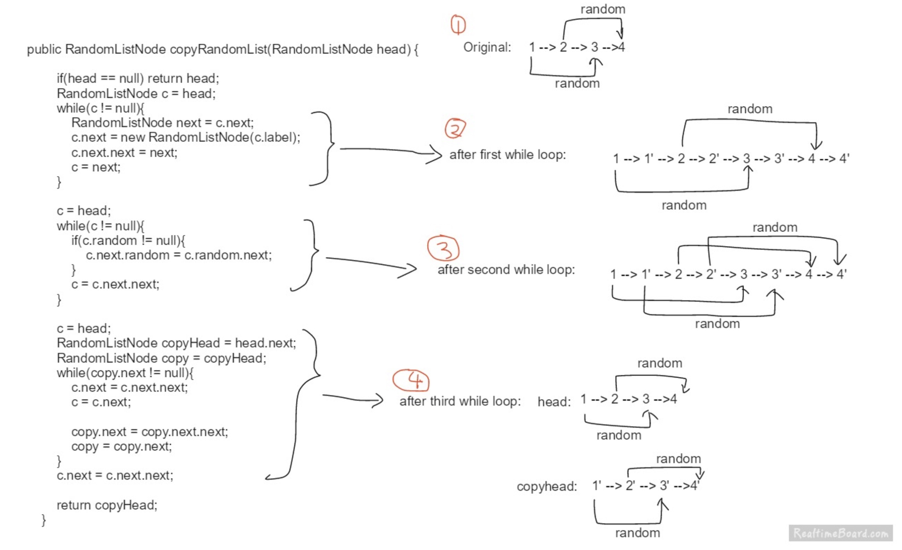

### 题目大意

给定一个链表，每个节点包含一个额外增加的随机指针，该指针可以指向链表中的任何节点或空节点。要求返回这个链表的 **深拷贝**。

我们用一个由 n 个节点组成的链表来表示输入/输出中的链表。每个节点用一个 [val, random_index] 表示：

val：一个表示 Node.val 的整数。
random_index：随机指针指向的节点索引（范围从 0 到 n-1）；如果不指向任何节点，则为 null 。

### 解题思路

这道题严格意义上是数据结构题，根据给定的数据结构，对它进行深拷贝。

1. 把复制每个 node 直接放到这个 node 的后面
2. 把每个复制的 node 的 random 指向正确的地方
3. 分开原本的 list 和复制的 list
   

```java
/*
// Definition for a Node.
class Node {
    int val;
    Node next;
    Node random;

    public Node(int val) {
        this.val = val;
        this.next = null;
        this.random = null;
    }
}
*/

class Solution {
    public Node copyRandomList(Node head) {
        if(head==null) return null;

        //复制节点
        Node cur = head;
        while(cur != null){
            Node next = cur.next;
            cur.next = new Node(cur.val);
            cur.next.next = next;
            cur = next;
        }

        //复制随机指针
        cur = head;
        while(cur!=null){
            if(cur.random!=null)
                cur.next.random = cur.random.next;
            cur = cur.next.next;     //必须要跳过复制的node，因为上一个复制的node的random此时已经不为null
        }

        //分离origin list和copy list
        cur = head;
        Node copyHead = head.next;
        Node copy = copyHead;

        //当loop到最后一个指向null的复制的node就会停止
        //这个时候origin list的最后一个node的next没有指向null
        while(copy.next!=null){
            cur.next = cur.next.next;
            cur = cur.next;

            copy.next = copy.next.next;
            copy = copy.next;
        }
        cur.next = cur.next.next;

        return copyHead;
    }
}
```
