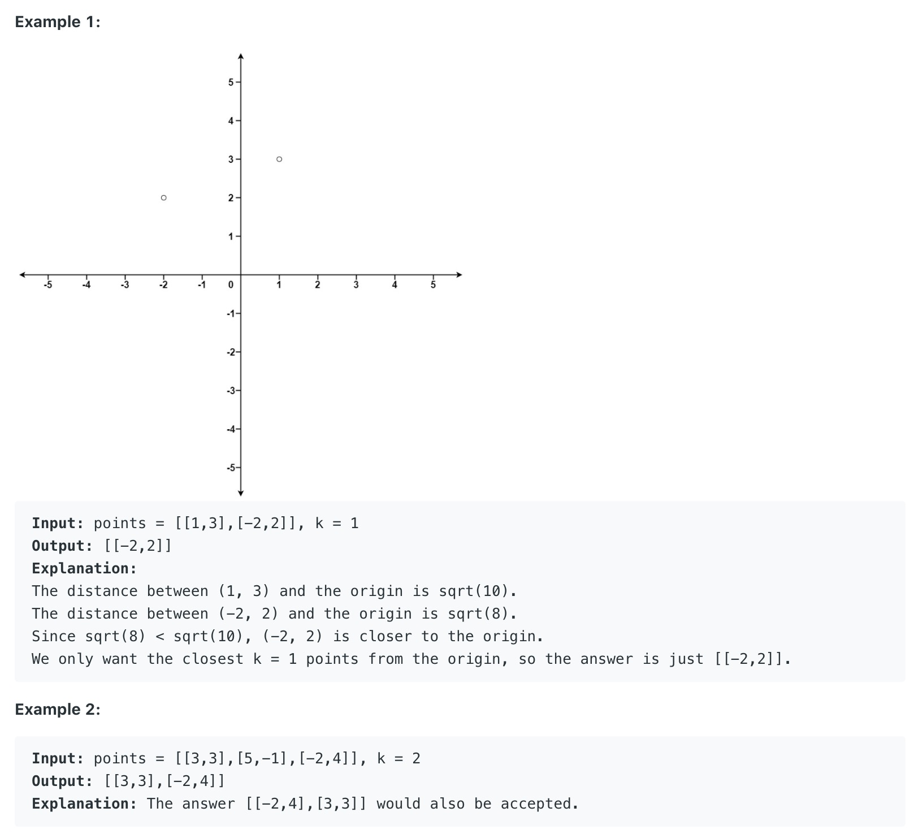

# 973. K Closest Points to Origin

## 题目大意

Given an array of points where points[i] = [xi, yi] represents a point on the X-Y plane and an integer k, return the k closest points to the origin (0, 0).

The distance between two points on the X-Y plane is the Euclidean distance (i.e., √(x1 - x2)2 + (y1 - y2)2).

You may return the answer in any order. The answer is guaranteed to be unique (except for the order that it is in).



## 解题思路

参考： https://leetcode.com/problems/k-closest-points-to-origin/discuss/220235/Java-Three-solutions-to-this-classical-K-th-problem.

1. Priority Queue

```java
class Solution {
    public int[][] kClosest(int[][] points, int k) {
        //implement maxheap
        //only retain k points in the pq
        //which are the k smallest points
        PriorityQueue<int[]> pq = new PriorityQueue<>(new Comparator<int[]>(){
            @Override
            public int compare(int[] p1, int[] p2){
                return (p2[0]*p2[0] + p2[1]*p2[1]) - (p1[0]*p1[0] + p1[1]*p1[1]);
            }
        });

        // lambda 写法
        // PriorityQueue<int[]> pq = new PriorityQueue<int[]>((p1, p2)->{
        //     return (p2[0]*p2[0] + p2[1]*p2[1]) - (p1[0]*p1[0] + p1[1]*p1[1]);
        // });

        for(int i=0; i<points.length; i++){
            pq.offer(points[i]);
            if(pq.size()>k){
                pq.poll();
            }
        }

        //这个地方容易错，关于k
        int[][] res = new int[k][2];
        while(k>0){
            res[--k] = pq.poll();
        }
        return res;
    }
}
```

2. rewrite Arrays.sort()

```java
class Solution {
    public int[][] kClosest(int[][] points, int k) {
        Arrays.sort(points, new Comparator<int[]>(){
            @Override
            public int compare(int[] p1, int[] p2){
                //ascending order
                return  (p1[0]*p1[0] + p1[1]*p1[1]) - (p2[0]*p2[0] + p2[1]*p2[1]);
            }
        });

        return Arrays.copyOfRange(points, 0, k);
    }
}
```

3. quick sort (also called quick select)

```java
class Solution {
    public int[][] kClosest(int[][] points, int k) {
        int l=0, r=points.length-1;
        while(l<=r){
            int mid = quicksort(points, l, r);
            if(mid == k-1) break;
            if(mid<k-1)
                l=mid+1;
            else
                r=mid-1;
        }

        return Arrays.copyOfRange(points, 0, k);
    }

    private int quicksort(int[][] points, int l, int r){
        int[] pivot = points[l];

        while(l<r){
            while(l<r && compare(points[r], pivot)>=0) r--;
            points[l] = points[r];
            while(l<r && compare(points[l], pivot)<=0) l++;
            points[r] = points[l];
        }

        points[l] = pivot;
        return l;
    }

    private int compare(int[] p1, int[] p2) {
        return p1[0] * p1[0] + p1[1] * p1[1] - p2[0] * p2[0] - p2[1] * p2[1];
    }
}
```
