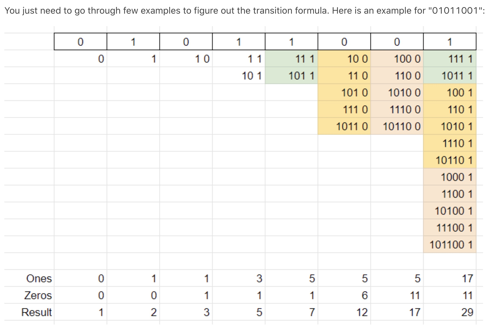

# 1987. Number of Unique Good Subsequences

## problem

You are given a binary string binary. A subsequence of binary is considered good if it is not empty and has no leading zeros (with the exception of "0").

Find the number of unique good subsequences of binary.

For example, if binary = "001", then all the good subsequences are ["0", "0", "1"], so the unique good subsequences are "0" and "1". Note that subsequences "00", "01", and "001" are not good because they have leading zeros.
Return the number of unique good subsequences of binary. Since the answer may be very large, return it modulo 10^9 + 7.

A subsequence is a sequence that can be derived from another sequence by deleting some or no elements without changing the order of the remaining elements.

Example 1:

Input: binary = "001"
Output: 2
Explanation: The good subsequences of binary are ["0", "0", "1"].
The unique good subsequences are "0" and "1".
Example 2:

Input: binary = "11"
Output: 2
Explanation: The good subsequences of binary are ["1", "1", "11"].
The unique good subsequences are "1" and "11".
Example 3:

Input: binary = "101"
Output: 5
Explanation: The good subsequences of binary are ["1", "0", "1", "10", "11", "101"].
The unique good subsequences are "0", "1", "10", "11", and "101".

Constraints:

1 <= binary.length <= 10^5
binary consists of only '0's and '1's.

## solution



the subsequence 0 is tricky,
so firstly we only count the case without any leading 0

We count the number of subsequence that ends with 0 and ends with 1.

**If we meed 0,**
we can append 0 to all existing ends0 + ends1 subsequences,
So ends0 = ends0 + ends1.

**If we meed 1,**
we can append 1 to all existing ends0 + ends1 subsequence,
So 1 is not in them, ends1 = ends0 + ends1 + 1.

The result is ends1 + ends2, and don't forget about 0.
The final result is ends1 + ends2 + has0.

## code

```java
class Solution {
    public int numberOfUniqueGoodSubsequences(String binary) {
        int ones = 0, zeros = 0;
        int has0 = 0, mod = (int)(1e9 + 7);

        for(char c : binary.toCharArray()){
            if(c=='1')
                ones = (zeros + ones + 1) % mod;
            else{
                zeros = (zeros + ones) % mod;
                has0 = 1; //leading 0
            }
        }

        return (ones + zeros + has0) % mod;
    }
}
```
