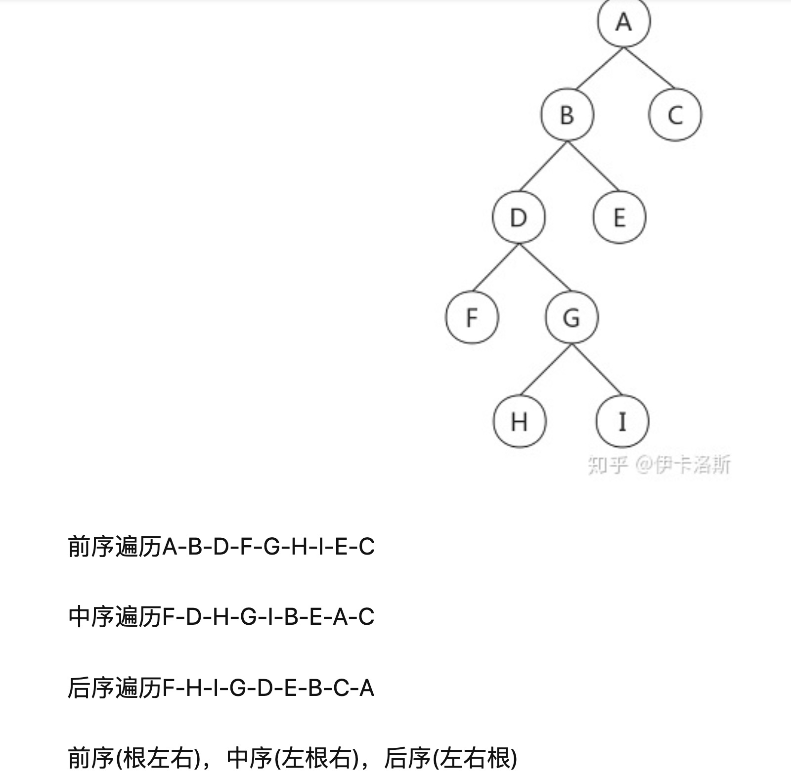

# Tree

## 1. recursion 递归

### 1.1 树与子树的一些递归

- [100. Same Tree](https://leetcode.com/problems/same-tree/):  
  [java](/solution_java/0100_Same_Tree.java)
- [572. Subtree of Another Tree](https://leetcode.com/problems/subtree-of-another-tree/):  
  [java](/solution_java/0572_Subtree_of_Another_Tree.java)  
  **一样的题**  
  [JZ17. 树的子结构](https://www.nowcoder.com/practice/6e196c44c7004d15b1610b9afca8bd88?tpId=13&&tqId=11170&rp=1&ru=/ta/coding-interviews&qru=/ta/coding-interviews/question-ranking):  
  [java](/牛客网/JZ17_树的子结构.java)

### 1.2 与 binary tree 的层数有关的一些递归

- [104. Maximum Depth of Binary Tree](https://leetcode.com/problems/maximum-depth-of-binary-tree/):
  [java](/solution_java/0104_Maximum_Depth_of_Binary_Tree.java)
- [Balanced Binary Tree](https://leetcode.com/problems/balanced-binary-tree/):
  [java](/solution_java/0110_Balanced_Binary_Tree.java)

### 1.3 与树的镜像有关的一些递归

- [101. Symmetric Tree](https://leetcode.com/problems/symmetric-tree/):
  [java](/solution_java/0101_Symmetric_Tree.java)
- [JZ18. 二叉树的镜像](https://www.nowcoder.com/practice/a9d0ecbacef9410ca97463e4a5c83be7?tpId=13&&tqId=11171&rp=1&ru=/ta/coding-interviews&qru=/ta/coding-interviews/question-ranking):
  [java](/solution_java/JZ18_二叉树的镜像.java)
- [226. Invert Binary Tree](https://leetcode.com/problems/invert-binary-tree/):
  [java](/solution_java/0226_Invert_Binary_Tree.java)

### 1.4 与树的路径有关的一些递归

- [112. Path Sum](https://leetcode.com/problems/path-sum/):
  [java](/solution_java/0112_Path_Sum.java)

## 2. 前根 / 中根 / 后根 遍历



### 2.1 preorder traversal (前序遍历)

### 2.1.1 preorder traversal using stack

逻辑是 traversal 到最左的根->左 leaf->右子树

```java
public List<Integer> preorderTraversal(TreeNode root) {
        List<Integer> list = new ArrayList<>();
        if(root==null) return list;

        Stack<TreeNode> stack = new Stack<>();
        stack.push(root);

        while(!stack.isEmpty()){
            TreeNode curr = stack.pop();
            list.add(curr.val);

            if(curr.right!=null)
                stack.push(curr.right);
            if(curr.left!=null)
                stack.push(curr.left);
        }

        return list;
    }
```

- [144. Binary Tree Preorder Traversal](https://leetcode.com/problems/binary-tree-preorder-traversal/):
  [java](/solution_java/0144_Binary_Tree_Preorder_Traversal.java)
- [114. Flatten Binary Tree to Linked List](https://leetcode.com/problems/flatten-binary-tree-to-linked-list/) | [java](/solution_java/0114_Flatten_Binary_Tree_to_Linked_List.java)

### 2.2 inorder travaersal (中根遍历)

### 2.2.1 iterative using stack

逻辑是先 iterative 到 left subtree 中最左的那个 node，然后由 left->root->right inorder 的顺序对 BST 进行遍历

```java
public List<Integer> inorderTraversal(TreeNode root) {
        List<Integer> list = new ArrayList<Integer>();
        Stack<TreeNode> stack = new Stack<TreeNode>();

        while(root!=null || !stack.isEmpty()){
            while(root!=null){
                stack.push(root);
                root = root.left;
            }

            root = stack.pop();
            list.add(root.val); //add after all left children
            root = root.right;
        }

       return list;
    }
```

- [98. Validate Binary Search Tree](https://leetcode.com/problems/validate-binary-search-tree/):
  [java](/solution_java/0098_Validate_Binary_Search_Tree.java)
- [230. Kth Smallest Element in a BST](https://leetcode.com/problems/kth-smallest-element-in-a-bst/):
  [java](/solution_java/0230_Kth_Smallest_Element_in_a_BST.java)
- [94. Binary Tree Inorder Traversal](https://leetcode.com/problems/binary-tree-inorder-traversal/):
  [java](/solution_java/0094_Binary_Tree_Inorder_Traversal.java)
- [面试题 04.06. 后继者](https://leetcode-cn.com/problems/successor-lcci/):
  [java](/力扣/面试题04-06_后继者.java)

### 2.2.2 recursion

- [99. Recover Binary Search Tree](https://leetcode.com/problems/recover-binary-search-tree/):
  [java](/solution_java/0099_Recover_Binary_Search_Tree.java)

### 2.3 postorder traversal (后序遍历)

### 2.3.1 postorder traversal using stack

逻辑是把 preorder 反过来

```java
public List<Integer> postorderTraversal(TreeNode root) {
        List<Integer> list = new ArrayList<>();
        if(root == null) return list;

        Stack<TreeNode> stack = new Stack<>();
        stack.push(root);

        while(!stack.isEmpty()){
            TreeNode curr = stack.pop();
            list.add(0,curr.val);

            if(curr.left!=null)
                stack.push(curr.left);
            if(curr.right!=null)
                stack.push(curr.right);
        }

        return list;
}
```

- [145. Binary Tree Postorder Traversal](https://leetcode.com/problems/binary-tree-postorder-traversal/):
  [java](/solution_java/0145_Binary_Tree_Postorder_Traversal.java)

## 3. level traversal 层层遍历

思路是用 depth 来 manage 当前的层数  
计算二叉树层数看 [104 题](/solution_java/0104_Maximum_Depth_of_Binary_Tree.java)

- [102. Binary Tree Level Order Traversal](https://leetcode.com/problems/binary-tree-level-order-traversal/):
  [java](/solution_java/0102_Binary_Tree_Level_Order_Traversal.java)
- [103. Binary Tree Zigzag Level Order Traversal](https://leetcode.com/problems/binary-tree-zigzag-level-order-traversal/):
  [java](/solution_java/0103_Binary_Tree_Zigzag_Level_Order_Traversal.java)
- [剑指 Offer*32-I*从上到下打印二叉树](https://leetcode-cn.com/problems/cong-shang-dao-xia-da-yin-er-cha-shu-lcof/):
  [java](/力扣/剑指Offer_32-I_从上到下打印二叉树.java)

## 4. 给出 preorder/inorder/postorder 中的两种，construct binary tree 构造二叉树

- [105. Construct Binary Tree from Preorder and Inorder Traversal](https://leetcode.com/problems/construct-binary-tree-from-preorder-and-inorder-traversal/):
  [java](/solution_java/0105_Construct_Binary_Tree_from_and_Inorder_Traversal.java)
- [106. Construct Binary Tree from Inorder and Postorder Traversal](https://leetcode.com/problems/construct-binary-tree-from-inorder-and-postorder-traversal/) | [java](/solution_java/0106_Construct_Binary_Tree_from_Inorder_and_Postorder_Traversal.java)

## 5. convert ... to BST vs convert BST to ...

### 5.1 convert ... to BST using Binary Search

- [108. Convert Sorted Array to Binary Search Tree](https://leetcode.com/problems/convert-sorted-array-to-binary-search-tree/):
  [java](/solution_java/0108_Convert_Sorted_Array_to_Binary_Search_Tree.java)
- [109. Convert Sorted List to Binary Search Tree](https://leetcode.com/problems/convert-sorted-list-to-binary-search-tree/):
  [java](/solution_java/0109_Convert_Sorted_List_to_Binary_Search_Tree.java)

### 5.2 convert BST to ...

- [jz26. 二叉搜索树与双向链表](https://www.nowcoder.com/practice/947f6eb80d944a84850b0538bf0ec3a5?tpId=13&tqId=11179&tPage=1&rp=1&ru=/ta/coding-interviews&qru=/ta/coding-interviews/question-ranking) | [java](/牛客网/JZ26_二叉搜索树与双向链表.java)

## 6. Serialize/Deserialize

using preorder + recursion

- [297. Serialize and Deserialize Binary Tree](https://leetcode.com/problems/serialize-and-deserialize-binary-tree/):
  [java](/solution_java/0297_Serialize_and_Deserialize_Binary_Tree.java)

## 7. dfs

- [124. Binary Tree Maximum Path Sum](https://leetcode.com/problems/binary-tree-maximum-path-sum/):
  [java](/solution_java/0124_Binary_Tree_Maximum_Path_Sum.java)
- [543. Diameter of Binary Tree](https://leetcode.com/problems/diameter-of-binary-tree/):
  [java](/solution_java/0543_Diameter_of_Binary_Tree.java)
- [199. Binary Tree Right Side View](https://leetcode.com/problems/binary-tree-right-side-view/):
  [java](/solution_java/0199_Binary_Tree_Right_Side_View.java)
- [236. Lowest Common Ancestor of a Binary Tree](https://leetcode.com/problems/lowest-common-ancestor-of-a-binary-tree/):
  [java](/solution_java/0236_Lowest_Common_Ancestor_of_a_Binary_Tree.java)

### 7.1 pathSum

- [112. Path Sum](https://leetcode.com/problems/path-sum/):
  [java](/solution_java/0112_Path_Sum.java)
- [113. Path Sum II](https://leetcode.com/problems/path-sum-ii/):
  [java](/solution_java/0113_Path_Sum_II.java)
- [437. Path Sum III](https://leetcode.com/problems/path-sum-iii/):
  [java](/solution_java/0437_Path_Sum_III.java)

### 7.2 dfs + hashmap

- [863. All Nodes Distance K in Binary Tree](https://leetcode.com/problems/all-nodes-distance-k-in-binary-tree/):
  [java](/solution_java/0863_All_Nodes_Distance_K_in_Binary_Tree.md)

## 前缀和 prefix sum using HashMap

二叉树的前缀和

```java
// key是前缀和, value是大小为key的前缀和出现的次数
Map<Integer, Integer> prefixSumCount = new HashMap<>();

// 当前路径上的和
currSum += node.val;
// currSum-target相当于找路径的起点，起点的sum+target=currSum，当前点到起点的距离就是target
res += prefixSumCount.getOrDefault(currSum - target, 0);
// 更新路径上当前节点前缀和的个数
prefixSumCount.put(currSum, prefixSumCount.getOrDefault(currSum, 0) + 1);

// 遍历完本层下面的路径，要回到本层，恢复状态，去除当前节点的前缀和数量
prefixSumCount.put(currSum, preSum.get(currSum) - 1);
```

- [437. Path Sum III](https://leetcode.com/problems/path-sum-iii/):
  [java](/solution_java/0437_Path_Sum_III.java)

## 8. constructe bst

I think the key idea of construct unique bst is

F(i, n) = G(i-1) \* G(n-i)

长度为 n，以 i 为 root 的 bst 是由
left tree = 长度为 i-1，有 i-1 个 possible root + right tree = 长度为 n-i，有 n-i 个 possible root 组成的

```
       1,2,3, ..., n

            k
        /       \
   1 ~ (k-1)    (k+1) ~ n

F(k, n) = 一共有 (k-1) x (n - k) 种 bst
```

- [96. Unique Binary Search Trees](https://leetcode.com/problems/unique-binary-search-trees/):
  [java](/solution_java/0096_Unique_Binary_Search_Trees.java)
- [95. Unique Binary Search Trees II](https://leetcode.com/problems/unique-binary-search-trees-ii/):
  [java](/solution_java/0095_Unique_Binary_Search_Trees_II.java)
