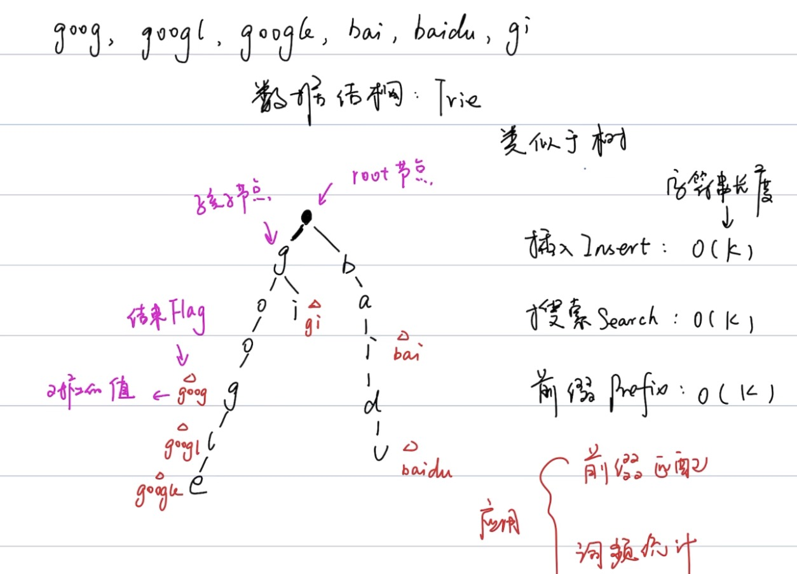

# Tire (pronounced as "try") or Prefix tree 字典树，前缀树

原理解释参考：
https://www.bilibili.com/video/BV1Az4y1S7c7?from=search&seid=1059550778259351768&spm_id_from=333.337.0.0

Definition：A trie (pronounced as "try") or prefix tree is a tree data structure used to efficiently store and retrieve keys in a dataset of strings. There are various applications of this data structure, such as autocomplete and spellchecker.

## implement a trie class - 实现 trie 结构

- [208. Implement Trie (Prefix Tree)](https://leetcode.com/problems/implement-trie-prefix-tree/):
  [java](/solution_java/0208_Implement_Trie.java)
- [720. Longest Word in Dictionary](https://leetcode.com/problems/longest-word-in-dictionary/):
  [java](/solution_java/0720_Longest_Word_in_Dictionary.java)
- [1268. Search Suggestions System](https://leetcode.com/problems/search-suggestions-system/):
  [java](/solution_java/1268_Search_Suggestions_System.md)

## trie + dfs

- [212. Word Search II](https://leetcode.com/problems/word-search-ii/):
  [java](/solution_java/0212_Word_Search_II.java)
