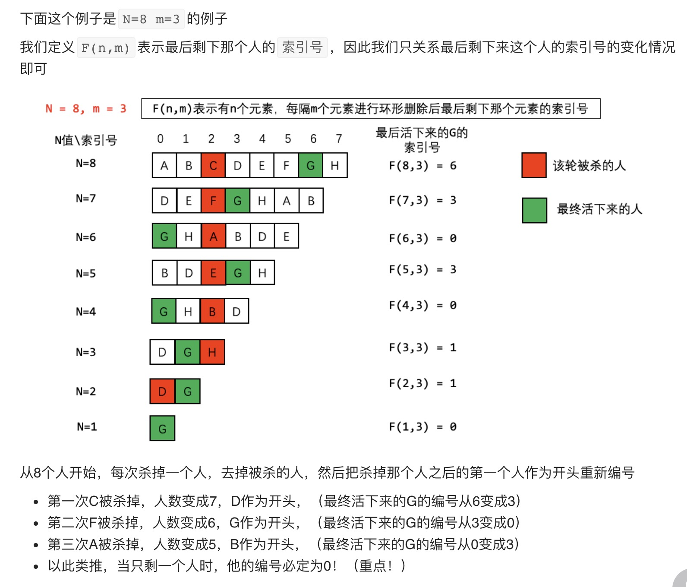

## 题目大意

0,1,···,n-1 这 n 个数字排成一个圆圈，从数字 0 开始，每次从这个圆圈里删除第 m 个数字（删除后从下一个数字开始计数）。
求出这个圆圈里剩下的最后一个数字。
例如，0、1、2、3、4 这 5 个数字组成一个圆圈，从数字 0 开始每次删除第 3 个数字，
则删除的前 4 个数字依次是 2、0、4、1，因此最后剩下的数字是 3。

输入: n = 5, m = 3
输出: 3
输入: n = 10, m = 17
输出: 2

## 解题思路

约塞夫问题

> N 个人围成一圈，第一个人从 1 开始报数，报 M 的将被杀掉，下一个人接着从 1 开始报。如此反复，最后剩下一个，求最后的胜利者。



f(n, m) = 最后活着的人的索引位置，反推可得

- n=1 f(n,m) = 0
- n>1 f(n,m) = (f(n-1, m) + m) % n

```java
class Solution {
    public int lastRemaining(int n, int m) {
        int index = 0; //最后活下来的人的索引号

        //索引号的动态变换公示：
        // i = 当前list的长度，范围：1～n
        // dp[i] = 长度i的数字排成圆圈最后活下来的人的索引号
        // dp[i] = (dp[i-1] + m) % i
        for(int i=2; i<=n; i++){
            index = (index + m)%i;
        }

        return index;
    }
}
```
